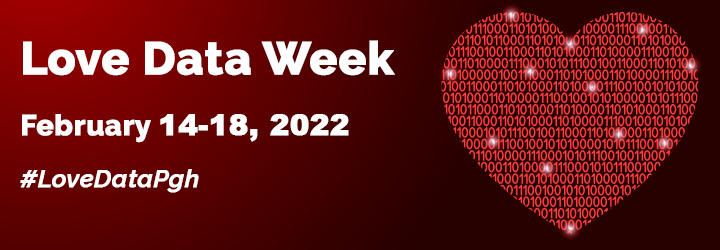

♥ Pitt loves data! ♥

Join us for Love Data Week 2022, **February 14-18**, for a collection of fascinating, data-oriented research talks, explorations of art and data, and hands-on software skills workshops.

This year, we are excited to invite the following Pitt community members to present about their research and art: 

* [Prof. Sergey Frolov](https://www.physicsandastronomy.pitt.edu/people/sergey-frolov), Department of Physics and Astronomy faculty
* [Prof. Edouard Machery](https://www.hps.pitt.edu/people/edouard-machery), Director, Center for Philosophy of Science
* [Dr. Aaron Myers-Brooks](https://www.music.pitt.edu/people/aaron-myers-brooks), Department of Music Faculty
* Some members of the [Contemporary Chinese Village Gazeteer Data](http://www.chinesevillagedata.library.pitt.edu/) project:
  * [Prof. Daqing  He](https://www.sci.pitt.edu/people/daqing-he), Associate Chair, Department of Informatics and Networked Systems
  * [Haihui Zhang](https://pitt.libguides.com/haihuizhang), Head, East Asian Library, and lead for the Contemporary Chinese Village Gazeteer Data project
  * Ruoyun Zheng, Project Coordinator of the Student Team

What is Love Data Week? It's a time to celebrate working with and managing data and code, brought to you by your friendly neighborhood data librarians. 

Want to make it social media official? Follow [**#LoveDataPgh**](https://twitter.com/search?q=%23lovedatapgh) on Twitter!

----------

## Love Data Week at a glance
Click titles to jump to full descriptions below. Researcher talks are in bold.

Monday, 2/14: [Getting Started in R and R Studio](#mon-uls-1) &ndash; [Preparing for the New NIH Data Management & Sharing Plan](#mon-hsls-1) &ndash; [R and RStudio Open Office Hour](#mon-uls-2)\
Tuesday, 2/15: [Publicly Available Social Justice Data](#tues-hsls-1) &ndash; [Data Sharing for Open Science](#tues-uls-1) &ndash; [Public 3D Scanning Events @ the Open Lab](#tues-uls-2)\
Wednesday, 2/16: **[Prof. Edouard Machery](#wed-uls-1)**\
Thursday, 2/17: [Spreadsheet data organization workshops](#spreadsheet)\
Friday, 2/18: **[Contemporary Chinese Village Gazetteer Data project](#fri-uls-1)** &ndash; **[Data and Music: Dr. Aaron Myers-Brooks](#fri-uls-2)** &ndash; [Intro to Glitch Art](#fri-uls-3)

----------

## Monday, 2/14
### Getting Started in R and R Studio (Online)
**12-1pm**, Zoom, hosted by University Library System
>R is a free, open-source software package and programming language for working with data, especially statistical analysis. RStudio is a popular software environment and toolset for using R. In this one-hour, online workshop, we will become oriented within the RStudio environment and explore in a cursory way several common tasks for data work, such as examining and filtering data, generating linear models, and creating simple plots. Participants are welcome to follow along hands-on or merely watch.

More info and RSVP: [https://pitt.libcal.com/event/8670585](https://pitt.libcal.com/event/8670585)

### Preparing for the New NIH Data Management & Sharing Plan: Session 1 -- Elements, Costs, & Tools (Online)
**12-1pm**, Zoom, hosted by Health Sciences Library System
>NIH has a new policy going into effect on January 25, 2023 that will require NIH-funded researchers to prospectively submit a plan outlining how scientific data from their research will be managed and shared. This session will cover the plan’s elements and allowable costs as well as tools to help with your own plan creation. This session is the first in a three-part series. Session 2 will cover locating and evaluating repositories (the “where” of data sharing). Session 3 will cover writing up documentation and metadata (the “how” of data sharing). 

More info and RSVP: [https://www.hsls.pitt.edu/instruction/preparing-new-nih-data-management-sharing-plan-session-1-elements-costs-tools/6796](https://www.hsls.pitt.edu/instruction/preparing-new-nih-data-management-sharing-plan-session-1-elements-costs-tools/6796)

### R and RStudio Open Office Hour (On Campus)
**5-6pm**, Hillman Library, G-74 Amy Knapp Room, hosted by University Library System
>Users of R and RStudio are invited to bring their questions to this weekly in-person office hour. Tutoring-style assistance is offered. If we don’t know the answer, we’ll help you look for it!

More info and RSVP: [https://pitt.libcal.com/event/8671418](https://pitt.libcal.com/event/8671418)

----------

## Tuesday, 2/15
### Publicly Available Social Justice Data (Online)
**8:30-10am**, Zoom, hosted by Health Sciences Library System
>There are thousands of federal, state, and local government sites that link the public to their data. Like much of the internet, it is easy to get lost trying to find data useful to your research unless you know where to go. This class is designed to introduce participants to commonly used measures of social justice through publicly available data sites. We will begin by exploring data sites that focus on social justice issues, such as income, education, pollution, housing, and healthy/risky behaviors. The social justice sites pull data from the federal government but since data is generally the most up to date on the home organization, we will follow the trail to the agency that gathered the data initially to look for updates and explore for other valuable information.

More info and RSVP: [https://www.hsls.pitt.edu/instruction/publicly-available-social-justice-data/5831](https://www.hsls.pitt.edu/instruction/publicly-available-social-justice-data/5831)

### Data Sharing for Open Science (Online)
**12:30-1pm**, Zoom, hosted by University Library System
>Data sharing is a key component of Open Science, and a research practice increasingly sought by funders. In this online presentation, we will discuss what is meant by “data sharing;” motivations and considerations in sharing your data; and how to share your data in practical terms.

More info and RSVP: [https://pitt.libcal.com/event/8669324](https://pitt.libcal.com/event/8669324)

### Public 3D Scanning Events @ the Open Lab (On Campus)
**1-4pm**, Hillman Library, Open Lab (Ground Floor), hosted by University Library System
>Join us at the Open Lab @ Hillman on the ground floor for weekly 3D scanning demonstrations! No registration is required--just drop in.

----------

## Wednesday, 2/16
### Prof. Edouard Machery, Director, Center for Philosophy of Science (Title TBA)
**12-1pm**, location and further details TBA, hosted by University Library System

----------

## Thursday, 2/17
### Spreadsheet Data Organization Workshops, 12-2pm

*for Health Sciences users:*
#### Data Organization in Spreadsheets (Online)
**12-1:30pm**, Zoom, hosted by Health Sciences Library System
>After this session you will be able to answer: What are some common challenges with formatting data in spreadsheets and how can we avoid them? How can we carry out basic quality assurance in spreadsheets? How can we export data from spreadsheets in a way that is useful for downstream applications? In this hands-on class we will be using the built in data validation tools in Excel, therefore please have access to a computer with this program installed if you plan on following along. Note: We will not be covering data analysis or statistics in this session. 

More info and RSVP: [https://www.hsls.pitt.edu/instruction/data-organization-spreadsheets/5837](https://www.hsls.pitt.edu/instruction/data-organization-spreadsheets/5837)

*for general Pitt users:*
#### Data TLC: Organizing Data with Spreadsheets Part 1 (Online)
**12-1pm**, Zoom, hosted by University Library System
>Good data organization is the foundation of any research project. Typically, we organize data in spreadsheets in ways that we as humans want to work with the data. However, computers require data to be structured in particular ways in order to use tools that make computation and analysis more efficient. In this workshop, participants will learn common uses for spreadsheets, good data entry and formatting practices, and how to avoid common formatting mistakes. This workshop will not cover data analysis with spreadsheets but will focus on the important initial “data wrangling” stage that enables you to do proper analysis later.

More info and RSVP: [https://pitt.libcal.com/event/8671219](https://pitt.libcal.com/event/8671219)

#### Data TLC: Organizing Data with Spreadsheets Part 2 (Online)
**1-2pm**, Zoom, hosted by University Library System
>Good data organization is the foundation of any research project. Typically, we organize data in spreadsheets in ways that we as humans want to work with the data. However, computers require data to be structured in particular ways in order to use tools that make computation and analysis more efficient. In this workshop, participants will learn how to document data for future use, basic quality control and data manipulation in spreadsheets, and how to export data from spreadsheets. This workshop will not cover data analysis with spreadsheets but will focus on the important initial “data wrangling” stage that enables you to do proper analysis later.

More info and RSVP: [https://pitt.libcal.com/event/8671226](https://pitt.libcal.com/event/8671226)

----------

## Friday, 2/18
### Contemporary Chinese Village Gazetteer Data project (Title TBA)
**10-11am**, location and further details TBA, hosted by University Library System

### Data and Music: Dr. Aaron Myers-Brooks, Pitt Department of Music faculty
**12-1pm**, Hillman Library, G-74 Amy Knapp Rm., hosted by University Library System
>Electronic Music presents a fascinating opportunity for the mixing and matching of disparate input and output data. My presentation will demonstrate three very different input methods, which will generate three very different sonic results. I will begin with drawings generated in HighC, a piece of software based around 20th century composer Iannis Xenakis’s UPIC program. These drawings will generate synthesized soundscapes. I will then perform an improvised hip-hop beat using a video game controller in conjunction with Ableton Live. Finally, I will demonstrate an excerpt from an in progress piece for microtonal guitar and real time effects processing.

Registration link forthcoming

### Intro to Glitch Art (Online)
**1-2pm**, Zoom, hosted by University Library System
>This online workshop will cover some of the various tools and techniques associated with the creation of Glitch Art. In addition, participants will be introduced to some of the history and conceptual theories surrounding glitch and Glitch Art. This workshop will use hex editor Notepad++ (PC, make sure to use 32 bit version) or Hex Fiend (Mac) and audio editing software Audacity for data bending. Please download both ahead of time if you want to follow along.

More info and RSVP: [https://pitt.libcal.com/event/8671329](https://pitt.libcal.com/event/8671329)

## ...and what else?
We love data all year! This is just a small sampling of our workshops. Check out the upcoming events at these institutions:
* [CMU Libraries](https://cmu.libcal.com/calendar/events/?cid=-1&t=m&d=0000-00-00&cal=-1&inc=0)
* [Pitt Health Sciences Library System](https://www.hsls.pitt.edu/calendar)
* [Pitt University Library System](https://pitt.libcal.com/calendar/today/?cid=2274&t=d&d=0000-00-00&cal=2274&inc=0)

---
This page is a collaboration between folx at the Pitt University Library System and Pitt Health Sciences Library System.
